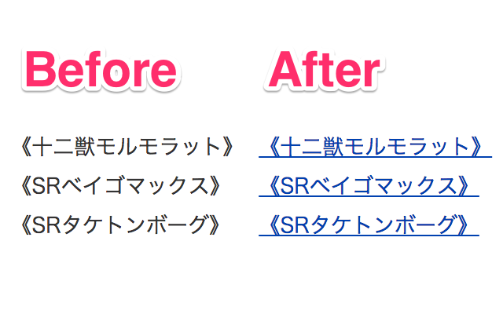

Autolink for Yu-Gi-Oh! Card Wiki
====

> :link: Convert texts surrounded by `《》` into links to [Yu-Gi-Oh! Card Wiki](http://yugioh-wiki.net/)

Detailed Description
----
This extension doesn't run at any URLs by default.  
Please set allowed domains to run this extension in the option page.

References
----
- [Wikiオートリンク](http://aitsu.skr.jp/2006/07/15/120.html)

Changelog
----
### 0.1.1
- Fix links of the card whose name contains `ァル` ([#1](https://github.com/itiut/autolink-for-yugioh-card-wiki/issues/1))
