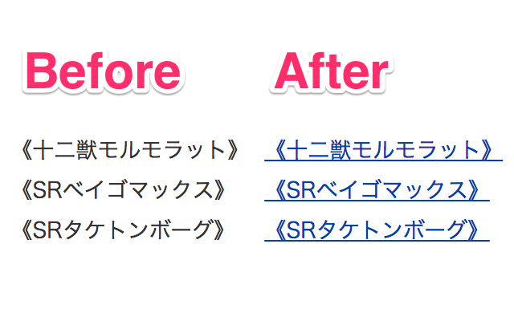

Autolink for 遊戯王カードWiki
====

> :link: `《》`で囲まれたテキストを[遊戯王カードWiki](http://yugioh-wiki.net/)へのリンクに変換します

詳細説明
----
この拡張機能はデフォルトではどのURLでも実行されません。  
拡張機能のオプションから、この拡張機能を実行するドメインを設定してください。

参考
----
- [Wikiオートリンク](http://aitsu.skr.jp/2006/07/15/120.html)
